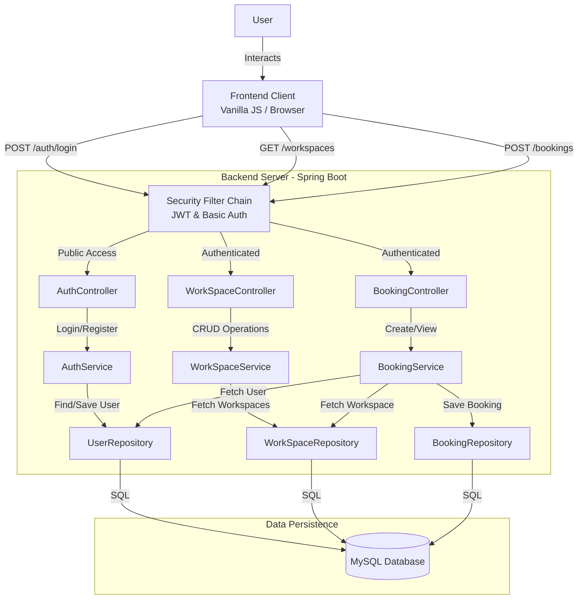

# DeskSpace Project Analysis & High-Level Design (HLD)

## 1. Executive Summary
**DeskSpace** is a workspace booking application consisting of a **Spring Boot Backend** (`DeskSpace`) and a **Vanilla JavaScript Frontend** (`deskSpace-FrontEnd`). The application allows users to register, log in via JWT authentication, browse available workspaces (desks/rooms), and book them for specific time slots.

**Key Observations:**
- **Architecture**: Monolithic Backend exposing REST APIs + Lightweight Frontend (SPA).
- **Security**: Stateless JWT Authentication.
- **Data**: JPA/Hibernate with MySQL (implied by dependencies).
- **Current State**: Functional prototype with core happy-path features implemented.

---

## 2. End-to-End Program Flows

### 2.1 User Authentication Flow
The entry point for all users. The application is secured, requiring a valid JWT for any operation beyond login/registration.

1.  **Registration**:
    -   **Frontend**: User fills `First Name`, `Last Name`, `Email`, `Password`, `Role` on `#register-form`.
    -   **Action**: `POST /api/auth/register` with JSON payload.
    -   **Backend**: [AuthController](file:///c:/Users/CHANDAN%20KUILYA/Music/FOLDER_DISC/NOW%20Phase%20Dev/Java_Backend/IntelliJ%20Ultimate/WorkSpace06/DeskSpace/src/main/java/com/ck/deskspace/controllers/AuthController.java#12-33) receives request -> [AuthService](file:///c:/Users/CHANDAN%20KUILYA/Music/FOLDER_DISC/NOW%20Phase%20Dev/Java_Backend/IntelliJ%20Ultimate/WorkSpace06/DeskSpace/src/main/java/com/ck/deskspace/services/AuthService.java#13-63) checks for existing email -> Hashes password (BCrypt) -> Saves `User` entity to DB.
    -   **Response**: 200 OK with success message.
    -   **Note**: A logic bug exists in [AuthService.java](file:///c:/Users/CHANDAN%20KUILYA/Music/FOLDER_DISC/NOW%20Phase%20Dev/Java_Backend/IntelliJ%20Ultimate/WorkSpace06/DeskSpace/src/main/java/com/ck/deskspace/services/AuthService.java) (Line 37) where `firstName` is incorrectly set to `request.getLastName()`.

2.  **Login**:
    -   **Frontend**: User enters `Email`, `Password`.
    -   **Action**: `POST /api/auth/login`.
    -   **Backend**: `AuthenticationManager` validates credentials -> `JwtService` creates a signed JWT token.
    -   **Response**: 200 OK with `{ token: "..." }`.
    -   **Frontend**: Stores token in `localStorage` -> Redirects to Dashboard.

### 2.2 Workspace Browsing Flow
Once logged in, the user encounters the main dashboard.

1.  **Dashboard Load**:
    -   **Frontend**: [showDashboard()](file:///c:/Users/CHANDAN%20KUILYA/Music/FOLDER_DISC/NOW%20Phase%20Dev/Java_Backend/IntelliJ%20Ultimate/WorkSpace06/deskSpace-FrontEnd/app.js#157-164) triggers [fetchWorkspaces()](file:///c:/Users/CHANDAN%20KUILYA/Music/FOLDER_DISC/NOW%20Phase%20Dev/Java_Backend/IntelliJ%20Ultimate/WorkSpace06/deskSpace-FrontEnd/app.js#165-185).
    -   **Action**: `GET /api/workspaces` (Authorization: Bearer Token).
    -   **Backend**: [WorkSpaceController](file:///c:/Users/CHANDAN%20KUILYA/Music/FOLDER_DISC/NOW%20Phase%20Dev/Java_Backend/IntelliJ%20Ultimate/WorkSpace06/DeskSpace/src/main/java/com/ck/deskspace/controllers/WorkSpaceController.java#12-38) calls `WorkSpaceService` -> Fetches all [WorkSpace](file:///c:/Users/CHANDAN%20KUILYA/Music/FOLDER_DISC/NOW%20Phase%20Dev/Java_Backend/IntelliJ%20Ultimate/WorkSpace06/DeskSpace/src/main/java/com/ck/deskspace/controllers/WorkSpaceController.java#12-38) entities -> Returns DTO list.
    -   **Frontend**: Maps the JSON array to HTML cards displaying Name, Capacity, Price, and Amenities.

### 2.3 Booking Flow
The core business logic.

1.  **Initiation**: User clicks "Book Now" on a workspace card -> Opens Modal.
2.  **Submission**:
    -   **Frontend**: User selects Start/End time. Validator checks `Start < End`.
    -   **Action**: `POST /api/bookings` with `{ workspaceId, startTime, endTime }`.
    -   **Backend**: 
        -   [SecurityConfig](file:///c:/Users/CHANDAN%20KUILYA/Music/FOLDER_DISC/NOW%20Phase%20Dev/Java_Backend/IntelliJ%20Ultimate/WorkSpace06/DeskSpace/src/main/java/com/ck/deskspace/config/SecurityConfig.java#23-125) extracts User Email from JWT.
        -   [BookingController](file:///c:/Users/CHANDAN%20KUILYA/Music/FOLDER_DISC/NOW%20Phase%20Dev/Java_Backend/IntelliJ%20Ultimate/WorkSpace06/DeskSpace/src/main/java/com/ck/deskspace/controllers/BookingController.java#14-38) passes user email + request to `BookingService`.
        -   Service creates [Booking](file:///c:/Users/CHANDAN%20KUILYA/Music/FOLDER_DISC/NOW%20Phase%20Dev/Java_Backend/IntelliJ%20Ultimate/WorkSpace06/DeskSpace/src/main/java/com/ck/deskspace/controllers/BookingController.java#21-30) entity associated with User and Workspace.
    -   **Response**: 201 Created.
    -   **Frontend**: Alerts success -> Closes Modal -> Refreshes "My Bookings".

### 2.4 User History Flow
1.  **View History**: User clicks "My Bookings" tab.
2.  **Action**: `GET /api/bookings/my-bookings`.
3.  **Backend**: Uses the JWT subject (email) to find bookings for that specific user only.
4.  **Frontend**: Renders list showing Workspace Name, Dates, and Status (CONFIRMED).

---

## 3. High-Level Design (HLD) Diagram

The following diagram illustrates the interaction between the User, Client (Frontend), and the Backend layers (Controller, Service, Repository, Database).

## 4. Technical Stack Breakdown

| Component | Technology | Description |
| :--- | :--- | :--- |
| **Frontend** | HTML5, CSS3, Vanilla JS | Lightweight, no frameworks. Uses [fetch](file:///c:/Users/CHANDAN%20KUILYA/Music/FOLDER_DISC/NOW%20Phase%20Dev/Java_Backend/IntelliJ%20Ultimate/WorkSpace06/deskSpace-FrontEnd/app.js#186-215) API. |
| **Backend Framework** | Spring Boot | MVC Architecture, Dependency Injection. |
| **Language** | Java 21 | Modern Java features. |
| **Security** | Spring Security + JWT | Stateless authentication. |
| **Database Access** | Spring Data JPA | interface-based repositories (Hibernate). |
| **Metrics** | Actuator + Micrometer | Prometheus-ready metrics exposure. |

## 5. Potential Improvements & Notes
1.  **Bug Fix**: In [AuthService.java](file:///c:/Users/CHANDAN%20KUILYA/Music/FOLDER_DISC/NOW%20Phase%20Dev/Java_Backend/IntelliJ%20Ultimate/WorkSpace06/DeskSpace/src/main/java/com/ck/deskspace/services/AuthService.java), line 37: `user.setFirstName(request.getLastName());` should be `getFirstName()`.
2.  **Validation**: Backend validation (e.g., checking if a workspace is *already* booked for a time slot) isn't explicitly visible in the controller but should be in `BookingService`.
3.  **Error Handling**: Frontend has basic error alerts; Backend likely has global exception handling (seen in `exception` package).
